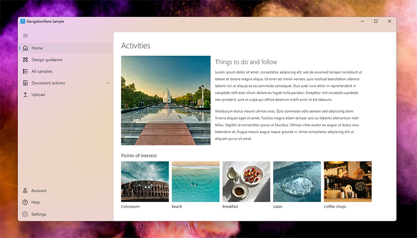
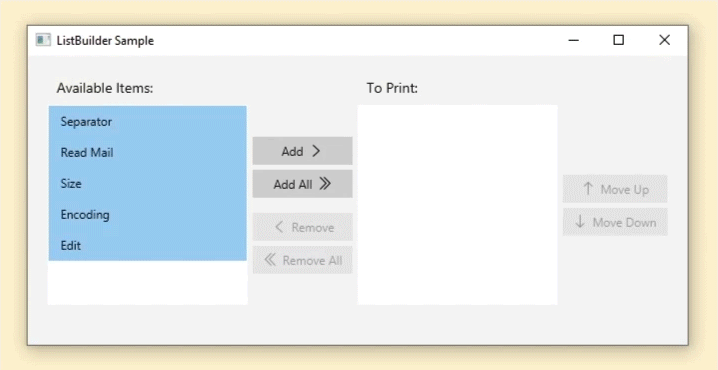
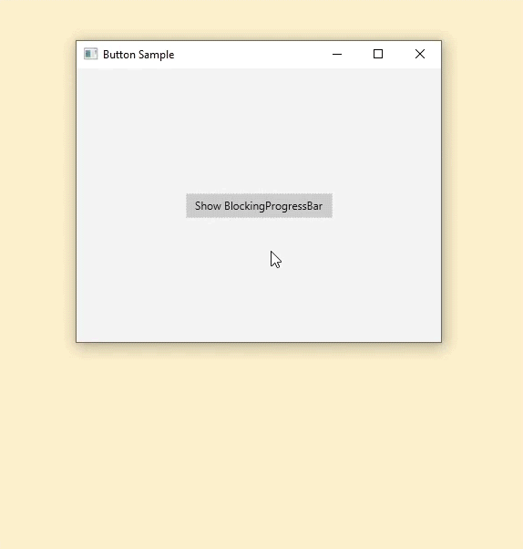
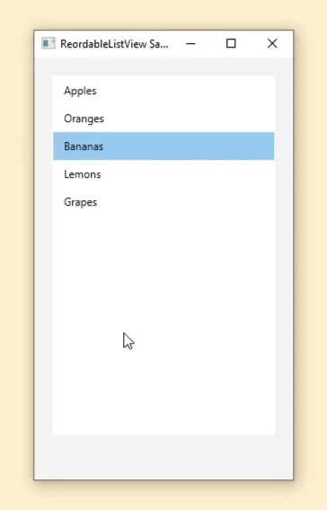

# FXComponents
A collection of controls for JavaFX.

- Navigation Pane  



- List Builder



- Blocking Progress Bar  



-  Reordable ListView



## Documentation
Documentation of FXComponents can be found in this link: [FXComponents documentation](https://pixelduke.com/fxcomponents/). 
You should check it if you want to know more about this library.

## How to get it
You can get the library through Maven Central.

Here are examples for Gradle and Maven (replace version number with the version you want):

#### Gradle
```groovy
implementation 'com.pixelduke:FXComponents:1.6'
```

#### Maven
```xml
<dependency>
    <groupId>com.pixelduke</groupId>
    <artifactId>FXComponents</artifactId>
    <version>1.6</version>
</dependency>
```

## Source code
The code of the FXComponents library is being compiled on Java 21 and JavaFX 22.

The FXComponents-samples subproject has samples that you can run and check out how to use FXComponents.

## Running the sample demos
To run the demos,  enter the following command in the Command Prompt / Terminal, inside the project directory:
```
gradlew run
```
Be sure to have your JAVA_HOME environment variable correctly set.  
To choose which of the demos to run, change the "gradle.build" script file inside "FXComponents-samples" folder and uncomment which 
Application derived class you'd like to execute.

## Pull Requests (PR)
We welcome contributions via PR.  
Before submitting a PR please file an issue for prior discussion. This will avoid you wasting time with a PR that
might not be approved because, for instance, might be outside the intended scope of the project.

### Filing bugs
When filing bugs it's most often good practice to attach a small sample app (as small, simple and with the fewest lines of 
code as possible). This app when executed, should show the bug happening.  
The reason for this is the limited amount of resources and time I have and also because in the process of filing a bug, 
developers sometimes discover that the bug isn't in the library but somewhere else.   
Without a small example app the issue might be closed prematurely.

## Feedback request
Please send pictures of your application that is using this library, or a site that shows your application. Or share it 
through Twitter (you can reference
me through my twitter handle @P_Duke if you'd like).   
This is very important for me to know how users are effectively using it and make adjustments accordingly to make this 
library better.
Also, and if you allow it, to showcase example uses.    
Seeing this library get used also always motivates me to keep working on it.

## Acknowledgements
Kudos to:
- Icons8 for the icons used in the sample apps, visit https://icons8.com for more information.
- Pexels for sample photos: https://www.pexels.com/

## License
FXComponents uses the ['GNU General Public License, version 2, with the Classpath Exception'](https://openjdk.java.net/legal/gplv2+ce.html)

